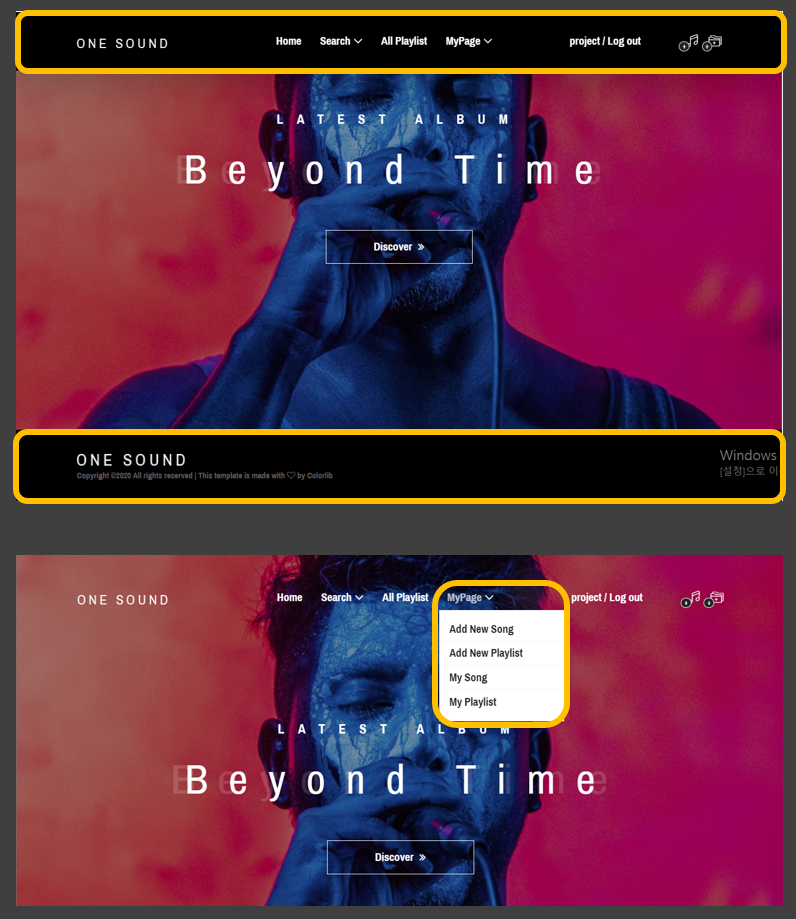
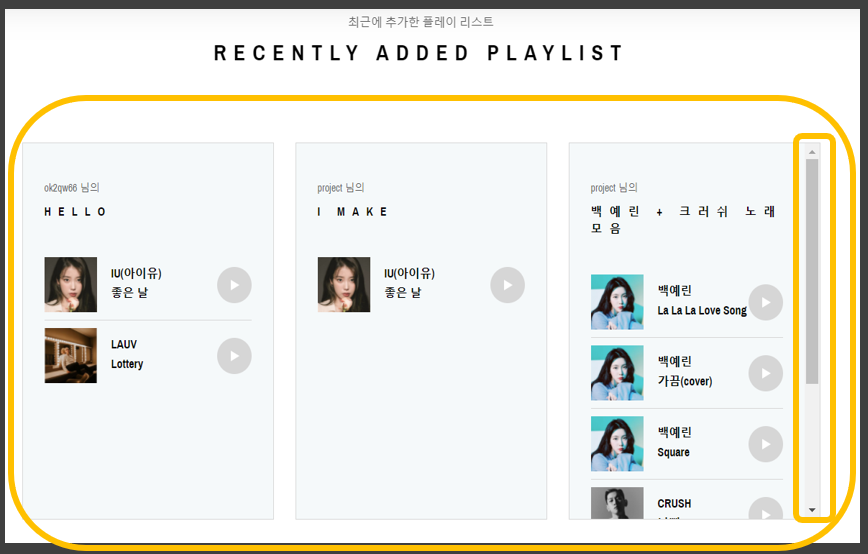
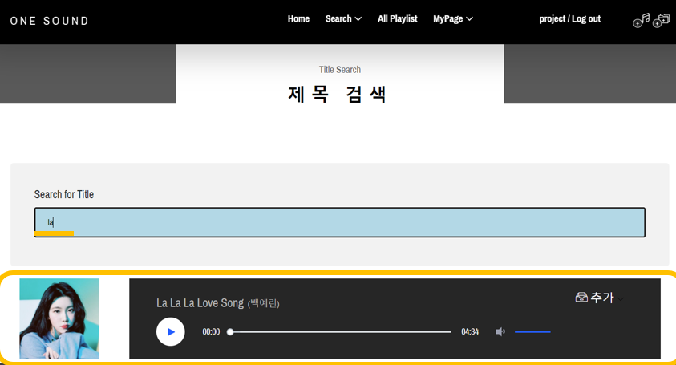
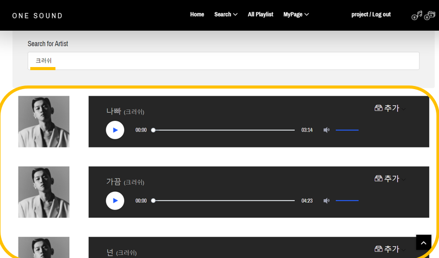
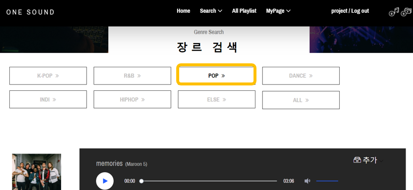
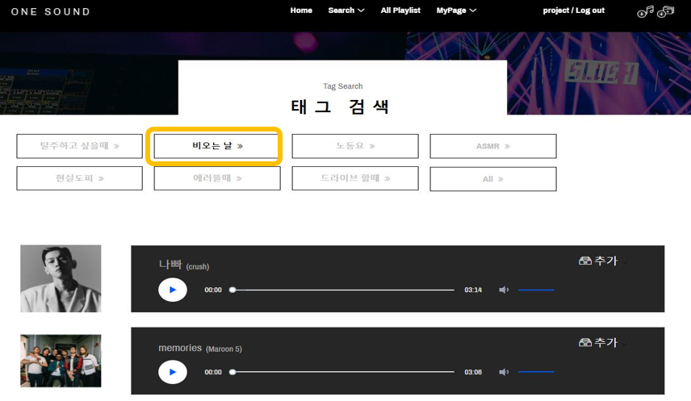
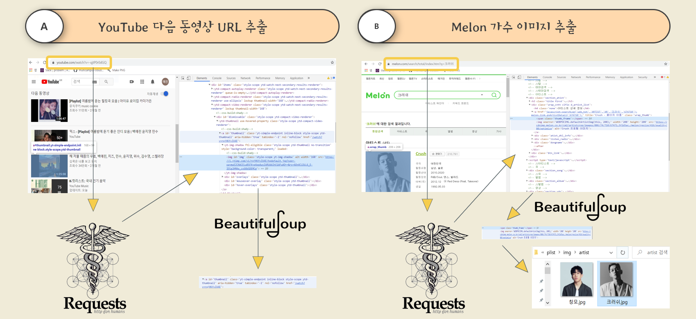
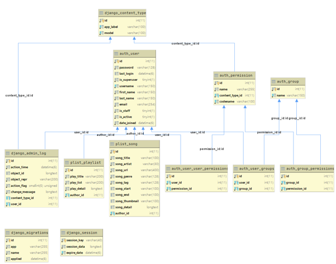

# Multi Campus Django Project

**Subject : Make Your Own Playlist with Youtube**

## One Sound

YouTube에서 음악들을 저장해서 나만의 플레이 리스트를 만들 수 있는 사이트입니다.

url에서 시작지점과 끝지점을 지정해서 원하는 음악을 mp3 파일로 저장 가능하고,

저장된 음악을 검색할 수 있습니다. 궁극적으로 저장된 음악들로 플레이리스트를 만들 수 있습니다.

## How to execute ?

> Python 3.7 버전을 이용
>
> **※ 향후 Docker 와 젠키스를 이용하여 배포 및 실행을 자동화할 수 있도록 설정할 예정**

1. git clone 받기

```bash
$ git clone https://github.com/multicampus-cloud/django_playlist.git
```

2. 가상환경 만들기

```bash
$ python -m venv venv
```

3. 가상환경 모드로 사용하도록 설정

```bash
$ source venv/Scripts/activate
```

4. 서비스 이용 시 필요한 패키지들 설치

```bash
$ pip install -r requirements.txt
```

5. 미디어 파일 인코딩을 위한 `ffmpeg.exe` 파일의 환경 변수 설정

   > 윈도우OS 기준으로 작성

   1. 제어판 - 시스템 진입
   2. 고급 시스템 설정 진입
   3. 시스템 속성 창에서 **환경 변수** 클릭
   4. `Path` 변수에 `ffmpeg.exe` 파일이 있는 폴더 경로를 추가

6. 검색을 위한 `elastic search` 서버 실행

   - `elasticsearch-7.9.0/bin` 폴더 진입
   - `elasticsearch.bat` 실행

7. DB에 저장되어 있는 정보를 `elastic search`를 통해 `indexing` 작업

```bash
$ python manage.py search_index --rebuild
```

8. 웹 서비스(Django) 실행

```bash
$ python manage.py runserver
```

## Architecture


## UI

👉 메인 페이지(1)



👉 메인 페이지(2) - 최근 추가한 노래정보


👉 메인 페이지(3) - 최근 추가한 플레이리스트



👉Search 페이지(1) - 제목 및 가수 검색





👉Search 페이지(2) - 장르 및 태그로 검색





### 사용 기술 및 환경

Django, MariaDB, ElasticSearch, Requests, BeautifulSoup, FFmpeg

영상처리를 위한 Python 라이브러리 : youtube-dl, pydub, pillow

### 기술 설명

#### 추천 url 및 가수 이미지 크롤링



#### Elastic Search

👉 DB의 SQL문을 활용하지 않고 엘라스틱을 사용한 이유

관계형 데이터베이스는 단순 텍스트 매칭에 대한 검색만을 제공

분산 처리를 통해 거의 실시간에 가까운 데이터 검색 가능

대량의 비정형 데이터 보관 및 검색 가능

전문검색 - 전체를 색인하여 특정 단어가 포함된 문서를 검색하는 것이 가능

### 프로젝트 DB



## Improve on

> Develope

1. EC2 에 서버 배포
2. MariaDB를 AWS RDS로 수정
3. Elastic-Search 를 Docker 로 실행
4. 로컬에 저장되는 이미지, mp3 파일들을 S3로 저장

> Operation

1. Jenkins 를 통한 CI/CD 달성

### [DEMO - VIDEO](https://user-images.githubusercontent.com/17541671/105449181-2d162d80-5cbb-11eb-9f09-0ce034d20ab2.mp4)
